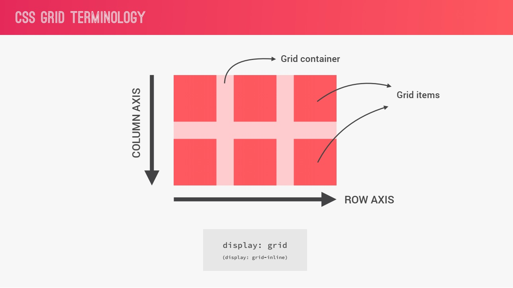
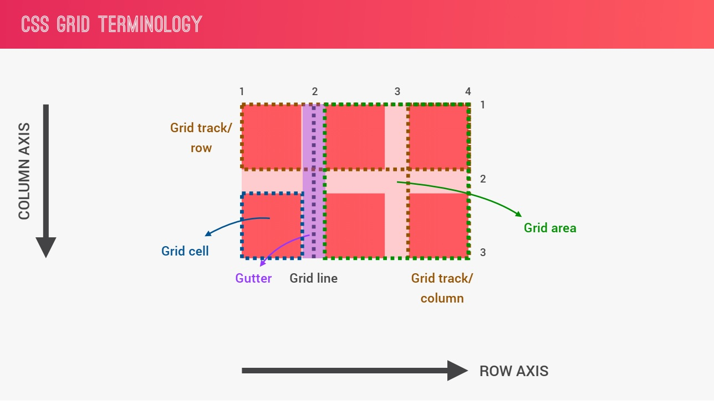
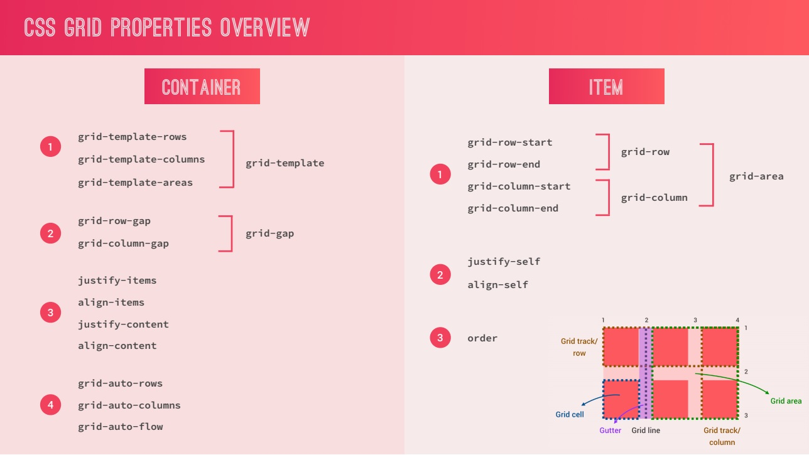

# Grid Layout

`Grid is a two-dimensional grid-based layout system`

## Grid Terminology



### Grid Container

- The element on which `display: grid` or `display: inline-grid` is applied
- It’s the direct parent of all the grid items

```html
<div class="container">
  <div class="item">Item 1</div>
  <div class="item">Item 2</div>
</div>
```

```css
.container {
  display: grid; /* display: inline-grid */
}
```

### Grid Item

- The children (i.e. direct descendants) of the grid container

```html
<div class="container">
  <div class="item">Item 1</div>
  <div class="item">
    <p class="sub-item">Sub item</p>
  </div>
  <div class="item">Item 2</div>
</div>
```

Here the item elements are grid items, but sub-item isn’t.



### Grid Line

- The dividing lines that make up the structure of the grid.
- They can be either vertical (“column grid lines”) or horizontal (“row grid lines”)

### Grid Cell

- The space between two adjacent row and two adjacent column grid lines.
- It’s a single “unit” of the grid.

### Grid Track

- the columns or rows of the grid.

### Grid Area

- A grid area may be composed of any number of grid cells.

## Grid Properties



### CONTAINER

#### `display`

- Defines the element as a grid container

```css
/* grid – generates a block-level grid */
/* inline-grid – generates an inline-level grid */

.container {
  display: grid | inline-grid;
}
```

#### grid-templates: grid-templates-rows, grid-template-columns, grid-templates-areas
